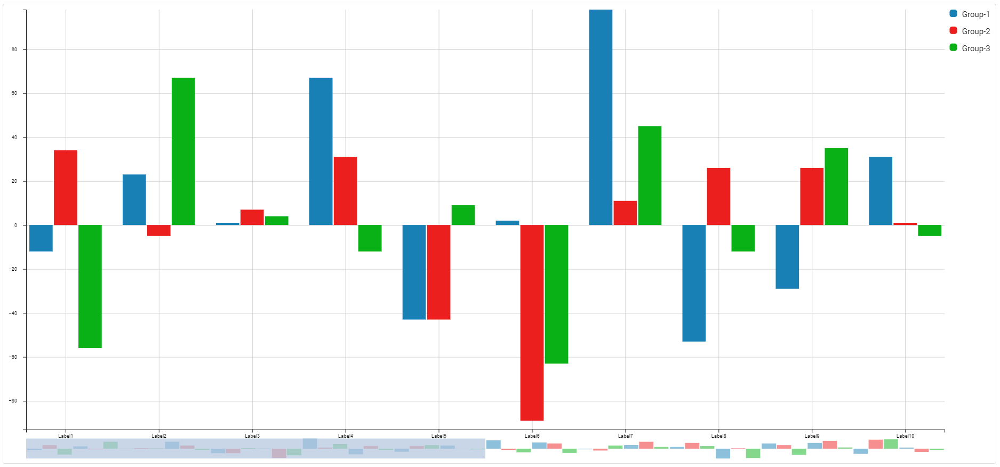
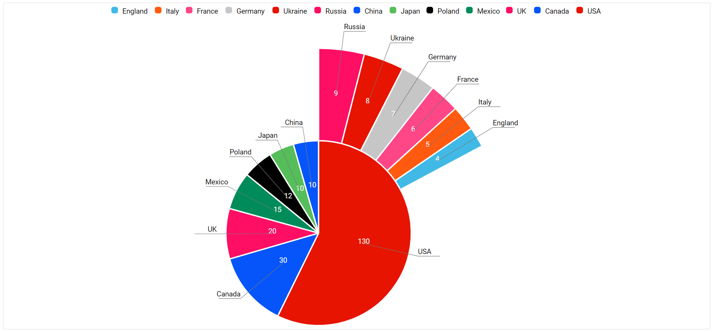
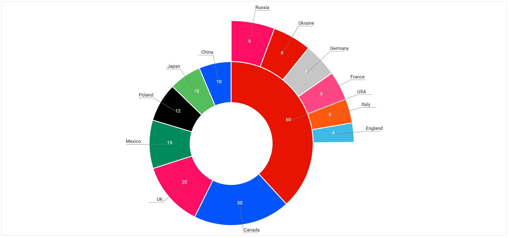
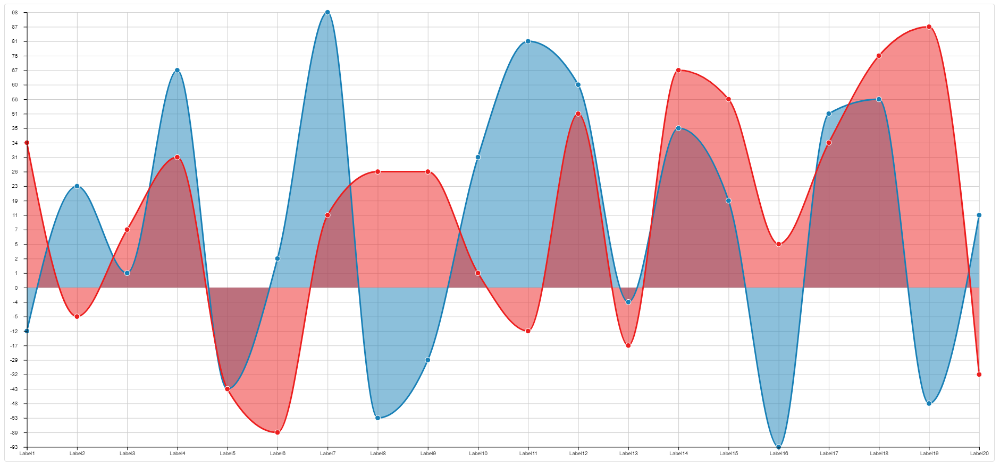
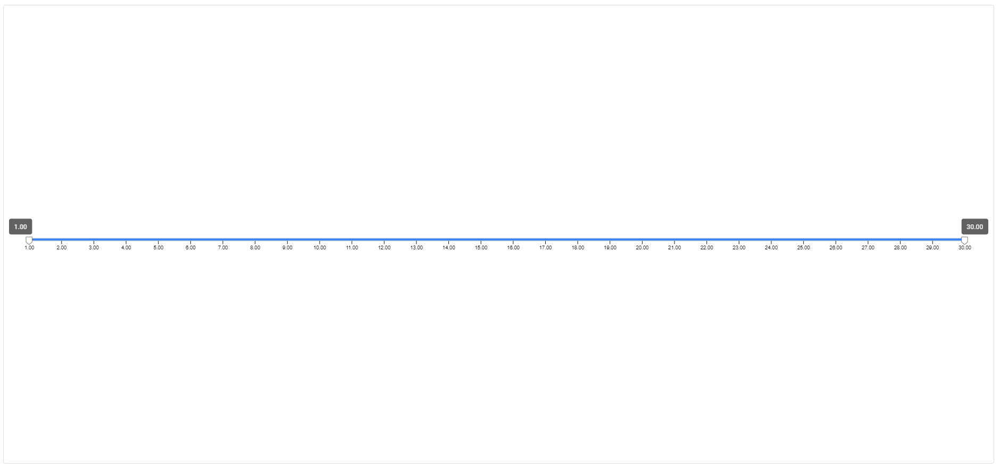
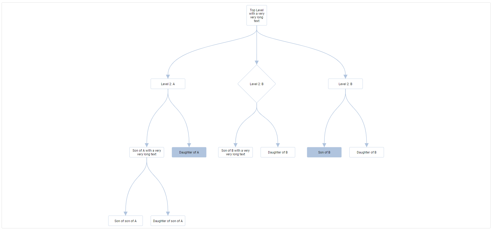
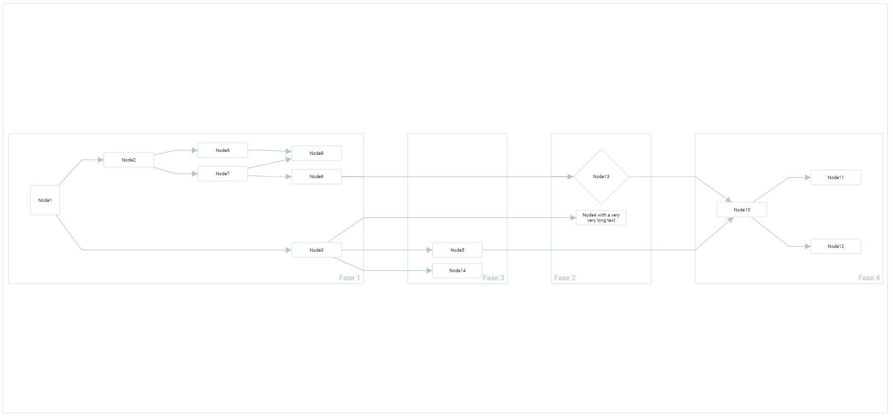
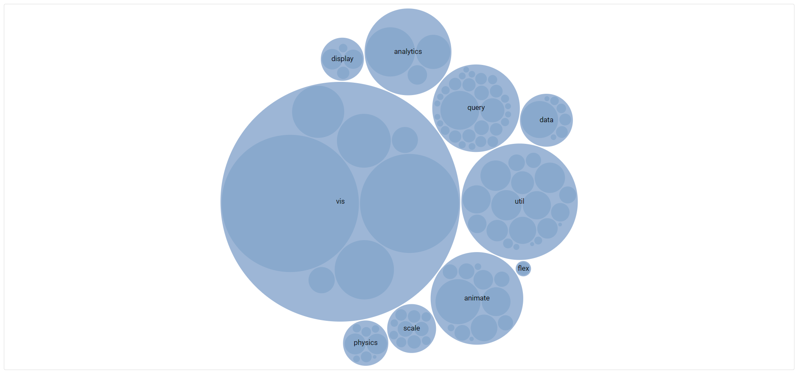

# CmD3Graphs

This library is an Angular library that builds most common graphs with the help of d3 and dagrejs libraries.\
With this library we have:
* histogram
* line chart
* pie
* donut
* range slider
* tree chart
* flow chart
* bubble chart

This is based on:
* [Angular 9](https://angular.io)
* [D3 6.3.1](https://d3js.org/)
* [Dagre 0.8.5](https://github.com/dagrejs/dagre)

## Index

1. [Install](#install)
2. [How to use](#how-to-use)
3. [Graph types](#graph-types)
    * [Histogram](#histogram)
      * [Configurations](#h-configurations)
      * [Data](#h-data)
      * [Component](#h-component)
      * [Example](#h-example)
    * [Pie](#pie)
      * [Configurations](#p-configurations)
      * [Data](#p-data)
      * [Component](#p-component)
      * [Example](#p-example)
    * [Donut](#donut)
      * [Configurations](#d-configurations)
      * [Data](#d-data)
      * [Component](#d-component)
      * [Example](#d-example)
    * [Line](#line)
      * [Configurations](#l-configurations)
      * [Data](#l-data)
      * [Component](#l-component)
      * [Example](#l-example)
    * [Range slider](#range-slider)
      * [Configurations](#r-configurations)
      * [Data](#r-data)
      * [Component](#r-component)
      * [Example](#r-example)
    * [Tree](#treee)
      * [Configurations](#t-configurations)
      * [Data](#t-data)
      * [Component](#t-component)
      * [Example](#t-example)
    * [Flow chart](#flow-chart)
      * [Configurations](#f-configurations)
      * [Data](#f-data)
      * [Component](#f-component)
      * [Example](#f-example)
    * [Bubble chart](#bubble-chart)
      * [Configurations](#b-configurations)
      * [Data](#b-data)
      * [Component](#b-component)
      * [Example](#b-example)
4. [Authors](#authors)
5. [License](#license)

## Install
``npm install d3 --save``

``npm install dagre --save``

``npm install @acimini/cm-d3-graphs --save``

Import in your app

```javascript
import { CmD3GraphsModule } from '@acimini/cm-d3-graphs';

@NgModule({
  imports: [ CmD3GraphsModule ],
  ...
})
```

## How to use

#### First define the configuration for the graph

```javascript
import {GraphTypeConfigurationInterface} from '@acimini/cm-d3-graphs';

const graphConf: GraphTypeConfigurationInterface = {
  ...
}
```
Each graph has its own configuration. See the sections below to check what is the configuration for the graph you choose.

#### Define the data for the graph

```javascript
import {GraphTypeDataInterface} from '@acimini/cm-d3-graphs';

const graphData: GraphTypeDataInterface = [
  ...
];
```
For the graph data there are a base interface that is suitable for the most of the graph types, and some specific for those graphs that have a more complex structure. See the sections below to check what is the data format for the graph you choose.

#### Use the graph component in the html

```angular2html
<cm-graph-type [graphConfigs]="graphConf" [graphData]="graphData"></cm-graph-type>
```
The component can need more inputs than those shown above. See the sections below to check what is the right way to use the component for the graph you choose.

<span style="color:blue">**IMPORTANT**</span>: the component must be enclosed in an element with **width** and **height** set.

## Graph types

Below it is shown the list of the available graph types.\
Each graph section is divided in four parts:
* Configurations: in this section, it is described what configurations are available for the graph and how use them.
* Data: in this section, it is described how data must be structured to work with the graph type choose.
* Component: in this section, it is show how to use the graph component in the html.
* Example: in this section, it is show an example of the usage of the graph choose.

### Histogram

#### <a name="h-configurations"></a>Configurations

To configure correctly the graph, it is possible to use the **HistogramGraphConfigurationInterface**

```javascript
import {HistogramGraphConfigurationInterface} from '@acimini/cm-d3-graphs';

const histogramConf: HistogramGraphConfigurationInterface = {
  ...
}
```

Below a list with all the configurations available for the histogram chart.\
Most of the configurations are optional and, if a value is not provided, a default one will be set.

###### id

A **string** that sets the id of the chart. It is **required**.

###### type

A **string** that defines the type of the graph. It is **required** and must be **histogram**.

###### margin

An **object** that sets the margins between the graph and its container.

```javascript
{
    top: number,
    bottom: number,
    left: number,
    right: number
}
```
If not provided, default value will be used.

```javascript
{
    top: 10,
    bottom: 10,
    left: 10,
    right: 10
}
```

###### maxDisplayedNumber

A **number** that defines the max number of data displayed in the graph.\
If the data length is grater than the value of this property, a scrollbar will be shown.

###### events

An **object** that sets the events enabled on the graph.

```javascript
{
    clickOnElement: boolean
}
```
* **clickOnElement**: if true, the event **clickOnBar** will be emitted each time user clicks on a bar. The event contains the data of the bar clicked.

If not provided, default value will be used.

```javascript
{
  clickOnElement: false
}
```

###### overflowX

A **boolean** that enables the overflow along the horizontal direction.\
If not provided, by default it is **false**.\
If enabled, the graph is not resized to the container width, and a horizontal scrollbar will be shown.

###### overflowY

A **boolean** that enables the overflow along the vertical direction.\
If not provided, by default it is **false**.\
If enabled, the graph is not resized to the container height, and a vertical scrollbar will be shown.

###### tooltipFormat

A **function** that defines the format of the tooltip that appears when the mouse goes on a bar.

```javascript
(label: string, value: number) => string
```
If not provided, default value will be used.

```javascript
(label, value) => label + ': ' + value
```

###### orientation

It can be **horizontal** or **vertical** and defines the orientation of the graph.\
If not provided, default value will be **vertical**.

###### grid

An **object** that defines the appearance of the grid.

```javascript
{
    axisX: boolean,
    axisY: boolean,
    color: string
}
```

* **axisX**: if true, enables the grid along the horizontal direction.
* **axisY**: if true, enables the grid along the vertical direction.
* **color**: defines the color of the grid.

If not provided, default value will be used.

```javascript
{
    axisX: true,
    axisY: true,
    color: '#ccc'
}
```

###### axis

An **object** that defines the appearance of the axes.

```javascript
{
    showAxisX: boolean,
    showAxisY: boolean,
    invertAxisX: boolean,
    invertAxisY: boolean,
    labelXOrientation: 'horizontal' | 'vertical' | 'oblique',
    labelYOrientation: 'horizontal' | 'vertical' | 'oblique',
    tickFormatX: (d: string) => string,
    tickFormatY: (d: string) => string,
    lineColor: string,
    textColor: string
}
```

* **showAxisX**: if true, enables the axis along the horizontal direction.
* **showAxisY**: if true, enables the axis along the vertical direction.
* **invertAxisX**: if true, inverts the axis along the horizontal direction.
* **invertAxisY**: if true, inverts the axis along the vertical direction.
* **labelXOrientation**: defines the orientation of the tick label for the horizontal axis.
* **labelYOrientation**: defines the orientation of the tick label for the vertical axis.
* **tickFormatX**: a function that returns the tick label formatted for the horizontal axis.
* **tickFormatY**: a function that returns the tick label formatted for the vertical axis.
* **lineColor**: defines the color of the axes.
* **textColor**: defines the tick label color.

If not provided, default value will be used.

```javascript
{
    showAxisX: true,
    showAxisY: true,
    invertAxisX: false,
    invertAxisY: false,
    labelXOrientation: 'horizontal',
    labelYOrientation: 'horizontal',
    lineColor: 'black',
    textColor: 'black'
}
```

###### groups

With the histogram we can represent one or more set of data in the same graph.\
The groups' configuration is an **array of objects** that defines the configuration for each set.

```javascript
{
    color: string,
    label: string
}
```

* **color**: defines the color of the bars that represent the set.
* **label**: defines the label of the set (it is useful in conjunction with the legend - see section below).

If not provided, the system automatically calculates the number of the sets from data provided, and for each create the default configuration.

```javascript
{
    color: '#1980B6',
    label: 'Group-' + index of the set
}
```

###### groupedType

Together with the previous configuration, it is possible define the type of grouping. It can be **inline** or **stacked**.\
If not provided, default value will be **inline**.

###### legend

An **object** that defines the visibility and the position of the legend.

```javascript
{
    enabled: boolean,
    position: 'bottom' | 'top' | 'left' | 'right'
}
```

* **enabled**: defines if the legend is enabled.
* **position**: defines the position of the legend.

If not provided, default value will be used.

```javascript
{
    enabled: false, 
    position: 'right'
}
```

#### <a name="h-data"></a>Data

The data for the histogram have a specific format, defined by the **HistogramGraphDataInterface**

```javascript
import {HistogramGraphDataInterface} from '@acimini/cm-d3-graphs';

const histogramData: HistogramGraphDataInterface[] = [
    {...},
    ...
]
```

Below a list with all the properties that the single data can have.\
Most of the properties are optional and, if a value is not provided, a default one will be set.

###### id

A **string** that defines the id of the data.\
If not provided, an **auto-calculated** value will be used.

###### label

A **string** that defines the label of the data. It is **required**.

###### values

An **array of numbers** that defines for each data the groups values. It is **required**.

###### extraData

An **object** that defines extra data associated with the data. It can contain each extra information.\
For example, it is returned whit the data under key **extraData**, when the user clicks on a bar.

#### <a name="h-component"></a>Component

When the configuration and the data are set, the last step is to import the component into the html.

```angular2html
<cm-histogram-chart [graphConfigs]="graphConf" [graphData]="graphData"></cm-histogram-chart>
```

<span style="color:blue">**IMPORTANT**</span>: the component must be enclosed in an element with **width** and **height** set.

#### <a name="h-example"></a>Example

Below an example

<details>
  <summary>Configuration</summary>

```javascript
import {HistogramGraphConfigurationInterface} from '@acimini/cm-d3-graphs';

const histogramConfs: HistogramGraphConfigurationInterface = {
  id: 'histogram_chart',
  type: 'histogram',
  groups: [
    {color: '#1980B6'},
    {color: '#ec1f1f'},
    {color: '#09b116'}
  ],
  axis: {
    invertAxisY: false,
    invertAxisX: false
  },
  orientation: 'vertical',
  maxDisplayedNumber: 10,
  legend: {
    position: 'right',
    enabled: true
  }
}
```

</details>

<details>
  <summary>Data</summary>

```javascript
import {HistogramGraphDataInterface} from '@acimini/cm-d3-graphs';

const histogramData: HistogramGraphDataInterface[] = [
  {values: [-12, 34, -56], label: 'Label1'},
  {values: [23, -5, 67], label: 'Label2'},
  {values: [1, 7, 4], label: 'Label3'},
  {values: [67, 31, -12], label: 'Label4'},
  {values: [-43, -43, 9], label: 'Label5'},
  {values: [2, -89, -63], label: 'Label6'},
  {values: [98, 11, 45], label: 'Label7'},
  {values: [-53, 26, -12], label: 'Label8'},
  {values: [-29, 26, 35], label: 'Label9'},
  {values: [31, 1, -5], label: 'Label10'},
  {values: [81, -12, -34], label: 'Label11'},
  {values: [60, 51, -41], label: 'Label12'},
  {values: [-4, -17, 31], label: 'Label13'},
  {values: [35, 67, 18], label: 'Label14'},
  {values: [19, 56, 25], label: 'Label15'},
  {values: [-93, 5, -89], label: 'Label16'},
  {values: [51, 34, -57], label: 'Label17'},
  {values: [56, 76, 12], label: 'Label18'},
  {values: [-48, 87, 90], label: 'Label19'},
  {values: [11, -32, -12], label: 'Label20'}
]
```

</details>




### Pie

#### <a name="p-configurations"></a>Configurations

To configure correctly the graph, it is possible to use the **PieGraphConfigurationInterface**

```javascript
import {PieGraphConfigurationInterface} from '@acimini/cm-d3-graphs';

const pieConf: PieGraphConfigurationInterface = {
  ...
}
```

Below a list with all the configurations available for the pie chart.\
Most of the configurations are optional and, if a value is not provided, a default one will be set.

###### id

A **string** that sets the id of the chart. It is **required**.

###### type

A **string** that defines the type of the graph. It is **required** and must be **pie**.

###### margin

An **object** that sets the margins between the graph and its container.

```javascript
{
    top: number,
    bottom: number,
    left: number,
    right: number
}
```
If not provided, default value will be used.

```javascript
{
    top: 10,
    bottom: 10,
    left: 10,
    right: 10
}
```

###### maxDisplayedNumber

A **number** that defines the max number of data displayed in the graph.\
If the data length is grater than the value of this property, slices will be distributed in crowns.

###### events

An **object** that sets the events enabled on the graph.

```javascript
{
    clickOnElement: boolean
}
```
* **clickOnElement**: if true, the event **clickOnSlice** will be emitted each time user clicks on a slice. The event contains the data of the slice clicked.

If not provided, default value will be used.

```javascript
{
  clickOnElement: false
}
```

###### overflowX

A **boolean** that enables the overflow along the horizontal direction.\
If not provided, by default it is **false**.\
If enabled, the graph is not resized to the container width, and a horizontal scrollbar will be shown.

###### overflowY

A **boolean** that enables the overflow along the vertical direction.\
If not provided, by default it is **false**.\
If enabled, the graph is not resized to the container height, and a vertical scrollbar will be shown.

###### tooltipFormat

A **function** that defines the format of the tooltip that appears when the mouse goes on a slice.

```javascript
(label: string, value: number) => string
```
If not provided, default value will be used.

```javascript
(label, value) => label + ': ' + value
```

###### slices

An **object** that defines the appearance of the slices.

```javascript
{
    colors: string[],
    textColor: string
}
```

* **colors**: an array that defines the color of each slice.
* **textColor**: defines the color of the slice label.

If not provided, default value will be used.

```javascript
{
    colors: ['#e61400', '#ff0f64', '#0555fa', '#008c5a', '#ff5a0f',
      '#ff4687', '#41b9e6', '#55be5a', '#c6c6c6', '#000000'],
    textColor: 'white'
}
```

If colors defined have dimension smaller than data dimension, they will be used cyclically.\
For example, if we have 11 data and 10 colors, for the 11th data will be used first color , and so on.

###### legend

An **object** that defines the visibility and the position of the legend.

```javascript
{
    enabled: boolean,
    position: 'bottom' | 'top' | 'left' | 'right'
}
```

* **enabled**: defines if the legend is enabled.
* **position**: defines the position of the legend.

If not provided, default value will be used.

```javascript
{
    enabled: false, 
    position: 'right'
}
```

#### <a name="p-data"></a>Data

The data for the pie have a specific format, defined by the **PieGraphDataInterface**

```javascript
import {PieGraphDataInterface} from '@acimini/cm-d3-graphs';

const pieData: PieGraphDataInterface[] = [
    {...},
    ...
]
```

Below a list with all the properties that the single data can have.\
Most of the properties are optional and, if a value is not provided, a default one will be set.

###### id

A **string** that defines the id of the data.\
If not provided, an **auto-calculated** value will be used.

###### label

A **string** that defines the label of the data. It is **required**.

###### value

A **number** that defines the value of the data. It is **required**.

###### extraData

An **object** that defines extra data associated with the data. It can contain each extra information.\
For example, it is returned whit the data under key **extraData**, when the user clicks on a slice.

###### slice

An **object** that defines the appearance of the single slice.

```javascript
{
  color: string;
}
```

* **color**: defines the color of the slice and overwrite the colors' property defined in configurations.

If not provided, the color from the configuration will be used.

#### <a name="p-component"></a>Component

When the configuration and the data are set, the last step is to import the component into the html.

```angular2html
<cm-pie-chart [graphConfigs]="graphConf" [graphData]="graphData"></cm-pie-chart>
```

<span style="color:blue">**IMPORTANT**</span>: the component must be enclosed in an element with **width** and **height** set.

#### <a name="p-example"></a>Example

Below an example

<details>
  <summary>Configuration</summary>

```javascript
import {PieGraphConfigurationInterface} from '@acimini/cm-d3-graphs';

const pieConfs: PieGraphConfigurationInterface = {
  id: 'pie_chart',
  type: 'pie',
  maxDisplayedNumber: 7,
  legend: {
    position: 'top',
    enabled: true
  }
};
```

</details>

<details>
  <summary>Data</summary>

```javascript
import {PieGraphDataInterface} from '@acimini/cm-d3-graphs';

const pieData: PieGraphDataInterface[] = [
  {label: 'USA', value: 130},
  {label: 'UK', value: 20},
  {label: 'Canada', value: 30},
  {label: 'Mexico', value: 15},
  {label: 'Italy', value: 5},
  {label: 'France', value: 6},
  {label: 'England', value: 4},
  {label: 'Japan', value: 10},
  {label: 'Germany', value: 7},
  {label: 'Poland', value: 12},
  {label: 'Ukraine', value: 8},
  {label: 'Russia', value: 9},
  {label: 'China', value: 10}
]
```

</details>




### Donut

#### <a name="d-configurations"></a>Configurations

To configure correctly the graph, it is possible to use the **PieGraphConfigurationInterface**

```javascript
import {PieGraphConfigurationInterface} from '@acimini/cm-d3-graphs';

const donutConf: PieGraphConfigurationInterface = {
  ...
}
```

Below a list with all the configurations available for the donut chart.\
Most of the configurations are optional and, if a value is not provided, a default one will be set.

###### id

A **string** that sets the id of the chart. It is **required**.

###### type

A **string** that defines the type of the graph. It is **required** and must be **donut**.

###### margin

An **object** that sets the margins between the graph and its container.

```javascript
{
    top: number,
    bottom: number,
    left: number,
    right: number
}
```
If not provided, default value will be used.

```javascript
{
    top: 10,
    bottom: 10,
    left: 10,
    right: 10
}
```

###### maxDisplayedNumber

A **number** that defines the max number of data displayed in the graph.\
If the data length is grater than the value of this property, slices will be distributed in crowns.

###### events

An **object** that sets the events enabled on the graph.

```javascript
{
    clickOnElement: boolean
}
```
* **clickOnElement**: if true, the event **clickOnSlice** will be emitted each time user clicks on a slice. The event contains the data of the slice clicked.

If not provided, default value will be used.

```javascript
{
  clickOnElement: false
}
```

###### overflowX

A **boolean** that enables the overflow along the horizontal direction.\
If not provided, by default it is **false**.\
If enabled, the graph is not resized to the container width, and a horizontal scrollbar will be shown.

###### overflowY

A **boolean** that enables the overflow along the vertical direction.\
If not provided, by default it is **false**.\
If enabled, the graph is not resized to the container height, and a vertical scrollbar will be shown.

###### tooltipFormat

A **function** that defines the format of the tooltip that appears when the mouse goes on a slice.

```javascript
(label: string, value: number) => string
```
If not provided, default value will be used.

```javascript
(label, value) => label + ': ' + value
```

###### slices

An **object** that defines the appearance of the slices.

```javascript
{
    colors: string[],
    textColor: string
}
```

* **colors**: an array that defines the color of each slice.
* **textColor**: defines the color of the slice label.

If not provided, default value will be used.

```javascript
{
    colors: ['#e61400', '#ff0f64', '#0555fa', '#008c5a', '#ff5a0f',
      '#ff4687', '#41b9e6', '#55be5a', '#c6c6c6', '#000000'],
    textColor: 'white'
}
```

If colors defined have dimension smaller than data dimension, they will be used cyclically.\
For example, if we have 11 data and 10 colors, for the 11th data will be used first color , and so on.

###### legend

An **object** that defines the visibility and the position of the legend.

```javascript
{
    enabled: boolean,
    position: 'bottom' | 'top' | 'left' | 'right'
}
```

* **enabled**: defines if the legend is enabled.
* **position**: defines the position of the legend.

If not provided, default value will be used.

```javascript
{
    enabled: false, 
    position: 'right'
}
```

#### <a name="d-data"></a>Data

The data for the donut have a specific format, defined by the **PieGraphDataInterface**

```javascript
import {PieGraphDataInterface} from '@acimini/cm-d3-graphs';

const donutData: PieGraphDataInterface[] = [
    {...},
    ...
]
```

Below a list with all the properties that the single data can have.\
Most of the properties are optional and, if a value is not provided, a default one will be set.

###### id

A **string** that defines the id of the data.\
If not provided, an **auto-calculated** value will be used.

###### label

A **string** that defines the label of the data. It is **required**.

###### value

A **number** that defines the value of the data. It is **required**.

###### extraData

An **object** that defines extra data associated with the data. It can contain each extra information.\
For example, it is returned whit the data under key **extraData**, when the user clicks on a slice.

###### slice

An **object** that defines the appearance of the single slice.

```javascript
{
  color: string;
}
```

* **color**: defines the color of the slice and overwrite the colors' property defined in configurations.

If not provided, the color from the configuration will be used.

#### <a name="d-component"></a>Component

When the configuration and the data are set, the last step is to import the component into the html.

```angular2html
<cm-pie-chart [graphConfigs]="graphConf" [graphData]="graphData"></cm-pie-chart>
```

<span style="color:blue">**IMPORTANT**</span>: the component must be enclosed in an element with **width** and **height** set.

#### <a name="d-example"></a>Example

Below an example

<details>
  <summary>Configuration</summary>

```javascript
import {PieGraphConfigurationInterface} from '@acimini/cm-d3-graphs';

const donutConfs: PieGraphConfigurationInterface = {
  id: 'donut_chart',
  type: 'donut',
  maxDisplayedNumber: 7
};
```

</details>

<details>
  <summary>Data</summary>

```javascript
import {PieGraphDataInterface} from '@acimini/cm-d3-graphs';

const donutData: PieGraphDataInterface[] = [
  {label: 'USA', value: 60},
  {label: 'UK', value: 20},
  {label: 'Canada', value: 30},
  {label: 'Mexico', value: 15},
  {label: 'Italy', value: 5},
  {label: 'France', value: 6},
  {label: 'England', value: 4},
  {label: 'Japan', value: 10},
  {label: 'Germany', value: 7},
  {label: 'Poland', value: 12},
  {label: 'Ukraine', value: 8},
  {label: 'Russia', value: 9},
  {label: 'China', value: 10}
]
```

</details>




### Line

#### <a name="l-configurations"></a>Configurations

To configure correctly the graph, it is possible to use the **LineGraphConfigurationInterface**

```javascript
import {LineGraphConfigurationInterface} from '@acimini/cm-d3-graphs';

const lineConf: LineGraphConfigurationInterface = {
  ...
}
```

Below a list with all the configurations available for the line chart.\
Most of the configurations are optional and, if a value is not provided, a default one will be set.

###### id

A **string** that sets the id of the chart. It is **required**.

###### type

A **string** that defines the type of the graph. It is **required** and must be **line**.

###### margin

An **object** that sets the margins between the graph and its container.

```javascript
{
    top: number,
    bottom: number,
    left: number,
    right: number
}
```
If not provided, default value will be used.

```javascript
{
    top: 10,
    bottom: 10,
    left: 10,
    right: 10
}
```

###### maxDisplayedNumber

A **number** that defines the max number of data displayed in the graph.\
If the data length is grater than the value of this property, a scrollbar will be shown.

###### events

An **object** that sets the events enabled on the graph.

```javascript
{
    clickOnElement: boolean
}
```
* **clickOnElement**: if true, the event **clickOnDot** will be emitted each time user clicks on a dot on the line. The event contains the data of the dot clicked.

If not provided, default value will be used.

```javascript
{
  clickOnElement: false
}
```

###### overflowX

A **boolean** that enables the overflow along the horizontal direction.\
If not provided, by default it is **false**.\
If enabled, the graph is not resized to the container width, and a horizontal scrollbar will be shown.

###### overflowY

A **boolean** that enables the overflow along the vertical direction.\
If not provided, by default it is **false**.\
If enabled, the graph is not resized to the container height, and a vertical scrollbar will be shown.

###### tooltipFormat

A **function** that defines the format of the tooltip that appears when the mouse goes on a dot.

```javascript
(label: string, value: number) => string
```
If not provided, default value will be used.

```javascript
(label, value) => label + ': ' + value
```

###### orientation

It can be **horizontal** or **vertical** and defines the orientation of the graph.\
If not provided, default value will be **vertical**.

###### grid

An **object** that defines the appearance of the grid.

```javascript
{
    axisX: boolean,
    axisY: boolean,
    color: string
}
```

* **axisX**: if true, enables the grid along the horizontal direction.
* **axisY**: if true, enables the grid along the vertical direction.
* **color**: defines the color of the grid.

If not provided, default value will be used.

```javascript
{
    axisX: true,
    axisY: true,
    color: '#ccc'
}
```

###### axis

An **object** that defines the appearance of the axes.

```javascript
{
    showAxisX: boolean,
    showAxisY: boolean,
    invertAxisX: boolean,
    invertAxisY: boolean,
    labelXOrientation: 'horizontal' | 'vertical' | 'oblique',
    labelYOrientation: 'horizontal' | 'vertical' | 'oblique',
    tickFormatX: (d: string) => string,
    tickFormatY: (d: string) => string,
    lineColor: string,
    textColor: string
}
```

* **showAxisX**: if true, enables the axis along the horizontal direction.
* **showAxisY**: if true, enables the axis along the vertical direction.
* **invertAxisX**: if true, inverts the axis along the horizontal direction.
* **invertAxisY**: if true, inverts the axis along the vertical direction.
* **labelXOrientation**: defines the orientation of the tick label for the horizontal axis.
* **labelYOrientation**: defines the orientation of the tick label for the vertical axis.
* **tickFormatX**: a function that returns the tick label formatted for the horizontal axis.
* **tickFormatY**: a function that returns the tick label formatted for the vertical axis.
* **lineColor**: defines the color of the axes.
* **textColor**: defines the tick label color.

If not provided, default value will be used.

```javascript
{
    showAxisX: true,
    showAxisY: true,
    invertAxisX: false,
    invertAxisY: false,
    labelXOrientation: 'horizontal',
    labelYOrientation: 'horizontal',
    lineColor: 'black',
    textColor: 'black'
}
```

###### groups

With the line we can represent one or more set of data in the same graph.\
The groups' configuration is an **array of objects** that defines the configuration for each set.

```javascript
{
    color: string,
    label: string
}
```

* **color**: defines the color of the line that represent the set.
* **label**: defines the label of the set (it is useful in conjunction with the legend - see section below).

If not provided, the system automatically calculates the number of the sets from data provided, and for each create the default configuration.

```javascript
{
    color: '#1980B6',
    label: 'Group-' + index of the set
}
```

###### hasArea

A **boolean** that enables the area under the line.

###### legend

An **object** that defines the visibility and the position of the legend.

```javascript
{
    enabled: boolean,
    position: 'bottom' | 'top' | 'left' | 'right'
}
```

* **enabled**: defines if the legend is enabled.
* **position**: defines the position of the legend.

If not provided, default value will be used.

```javascript
{
    enabled: false, 
    position: 'right'
}
```

#### <a name="l-data"></a>Data

The data for the line have a specific format, defined by the **LineGraphDataInterface**

```javascript
import {LineGraphDataInterface} from '@acimini/cm-d3-graphs';

const lineData: LineGraphDataInterface[] = [
    {...},
    ...
]
```

Below a list with all the properties that the single data can have.\
Most of the properties are optional and, if a value is not provided, a default one will be set.

###### id

A **string** that defines the id of the data.\
If not provided, an **auto-calculated** value will be used.

###### label

A **string** that defines the label of the data. It is **required**.

###### values

An **array of numbers** that defines for each data the groups values. It is **required**.

###### extraData

An **object** that defines extra data associated with the data. It can contain each extra information.\
For example, it is returned whit the data under key **extraData**, when the user clicks on a dot on the line.

#### <a name="l-component"></a>Component

When the configuration and the data are set, the last step is to import the component into the html.

```angular2html
<cm-line-chart [graphConfigs]="graphConf" [graphData]="graphData"></cm-line-chart>
```

<span style="color:blue">**IMPORTANT**</span>: the component must be enclosed in an element with **width** and **height** set.

#### <a name="l-example"></a>Example

Below an example

<details>
  <summary>Configuration</summary>

```javascript
import {LineGraphConfigurationInterface} from '@acimini/cm-d3-graphs';

const lineConfs: LineGraphConfigurationInterface = {
  id: 'line_chart',
  type: 'line',
  groups: [
    {color: '#1980B6'},
    {color: '#ec1f1f'}
  ]
}
```

</details>

<details>
  <summary>Data</summary>

```javascript
import {LineGraphDataInterface} from '@acimini/cm-d3-graphs';

const lineData: LineGraphDataInterface[] = [
  {values: [-12, 34], label: 'Label1'},
  {values: [23, -5], label: 'Label2'},
  {values: [1, 7], label: 'Label3'},
  {values: [67, 31], label: 'Label4'},
  {values: [-43, -43], label: 'Label5'},
  {values: [2, -89], label: 'Label6'},
  {values: [98, 11], label: 'Label7'},
  {values: [-53, 26], label: 'Label8'},
  {values: [-29, 26], label: 'Label9'},
  {values: [31, 1], label: 'Label10'},
  {values: [81, -12], label: 'Label11'},
  {values: [60, 51], label: 'Label12'},
  {values: [-4, -17], label: 'Label13'},
  {values: [35, 67], label: 'Label14'},
  {values: [19, 56], label: 'Label15'},
  {values: [-93, 5], label: 'Label16'},
  {values: [51, 34], label: 'Label17'},
  {values: [56, 76], label: 'Label18'},
  {values: [-48, 87], label: 'Label19'},
  {values: [11, -32], label: 'Label20'}
]
```

</details>




### Range slider

#### <a name="r-configurations"></a>Configurations

To configure correctly the graph, it is possible to use the **RangeSliderGraphConfigurationInterface**

```javascript
import {RangeSliderGraphConfigurationInterface} from '@acimini/cm-d3-graphs';

const rangeSliderConf: RangeSliderGraphConfigurationInterface = {
  ...
}
```

Below a list with all the configurations available for the range slider chart.\
Most of the configurations are optional and, if a value is not provided, a default one will be set.

###### id

A **string** that sets the id of the chart. It is **required**.

###### type

A **string** that defines the type of the graph. It is **required** and must be **range-slider**.

###### margin

An **object** that sets the margins between the graph and its container.

```javascript
{
    top: number,
    bottom: number,
    left: number,
    right: number
}
```
If not provided, default value will be used.

```javascript
{
    top: 10,
    bottom: 10,
    left: 10,
    right: 10
}
```

###### events

An **object** that sets the events enabled on the graph.

```javascript
{
    rangeChanging: boolean,
    rangeChanged: boolean
}
```
* **rangeChanging**: if true, the event **rangeChanging** will be emitted during range selection. The event contains the data of the range selected.
* **rangeChanged**: if true, the event **rangeChanged** will be emitted at the end of selection. The event contains the data of the range selected.

If not provided, default value will be used.

```javascript
{
    rangeChanging: false,
    rangeChanged: false
}
```

###### overflowX

A **boolean** that enables the overflow along the horizontal direction.\
If not provided, by default it is **false**.\
If enabled, the graph is not resized to the container width, and a horizontal scrollbar will be shown.

###### overflowY

A **boolean** that enables the overflow along the vertical direction.\
If not provided, by default it is **false**.\
If enabled, the graph is not resized to the container height, and a vertical scrollbar will be shown.

###### tooltipFormat

A **function** that defines the format of the tooltip that appears when the mouse goes on a dot.

```javascript
(label: string, value: number) => string
```
If not provided, default value will be used.

```javascript
(label, value) => label + ': ' + value
```

###### orientation

It can be **horizontal** or **vertical** and defines the orientation of the graph.\
If not provided, default value will be **horizontal**.

###### axis

An **object** that defines the appearance of the axes.

```javascript
{
    showAxisX: boolean,
    showAxisY: boolean,
    invertAxisX: boolean,
    invertAxisY: boolean,
    labelXOrientation: 'horizontal' | 'vertical' | 'oblique',
    labelYOrientation: 'horizontal' | 'vertical' | 'oblique',
    tickFormatX: (d: string) => string,
    tickFormatY: (d: string) => string,
    lineColor: string,
    textColor: string
}
```

* **showAxisX**: if true, enables the axis along the horizontal direction.
* **showAxisY**: if true, enables the axis along the vertical direction.
* **invertAxisX**: if true, inverts the axis along the horizontal direction.
* **invertAxisY**: if true, inverts the axis along the vertical direction.
* **labelXOrientation**: defines the orientation of the tick label for the horizontal axis.
* **labelYOrientation**: defines the orientation of the tick label for the vertical axis.
* **tickFormatX**: a function that returns the tick label formatted for the horizontal axis.
* **tickFormatY**: a function that returns the tick label formatted for the vertical axis.
* **lineColor**: defines the color of the axes.
* **textColor**: defines the tick label color.

If not provided, default value will be used.

```javascript
{
    showAxisX: true,
    showAxisY: false,
    invertAxisX: false,
    invertAxisY: false,
    labelXOrientation: 'horizontal',
    labelYOrientation: 'horizontal',
    lineColor: 'black',
    textColor: 'black'
}
```

###### track

An **object** that defines the appearance of the track.

```javascript
{
    color: string,
    width: number,
    insetColor: string,
    insetWidth: number,
    fillColor: string,
    fillWidth: number
}
```

* **color**: defines the border color of the track.
* **width**: defines the border width of the track.
* **insetColor**: defines the color of the track outside the range selected.
* **insetWidth**: defines the width of the track outside the range selected.
* **fillColor**: defines the color of the track into the range selected.
* **fillWidth**: defines the width of the track into the range selected.

If not provided, default value will be used.

```javascript
{
    color: '#bbb',
    width: 6,
    insetColor: '#eee',
    insetWidth: 4,
    fillColor: '#3883fa',
    fillWidth: 4
}
```

###### interval

An **object** that defines the values' interval.

```javascript
{
    type: 'discrete' | 'continuous',
    step: number
}
```

* **type**: if set to **discrete**, the interval will be discrete and only values defined in data will be selectable. If set to **continuos**, all values between start and end values will be selectable.
* **step**: defines minimum range selectable. It works if handle type is **double**.

If not provided, default value will be used.

```javascript
{
    type: 'discrete'
}
```

###### handle

An **object** that defines the appearance of the handle.

```javascript
{
    strokeColor: string,
    fillColor: string,
    type: 'single' | 'double',
    showTooltip: 'never' | 'always' | 'on-hover'
}
```

* **strokeColor**: defines the border color of the handle.
* **fillColor**: defines the inner color of the handle.
* **type**: if it is **single**, we will have a **single handle**, and we can select only a specific value of the interval. If it is **double**, we will have **two handles** and we can select a range.
* **showTooltip**: set the visibility of the handle tooltip.

If not provided, default value will be used.

```javascript
{
    strokeColor: '#777',
    fillColor: 'white',
    type: 'double',
    showTooltip: 'always'
}
```

#### <a name="r-data"></a>Data

The data for the range slider have a specific format, defined by the **RangeSliderGraphDataInterface**

```javascript
import {RangeSliderGraphDataInterface} from '@acimini/cm-d3-graphs';

const rangeSliderData: RangeSliderGraphDataInterface[] = [
    {...},
    ...
]
```

Below a list with all the properties that the single data can have.\
Most of the properties are optional and, if a value is not provided, a default one will be set.

###### id

A **string** that defines the id of the data.\
If not provided, an **auto-calculated** value will be used.

###### label

A **string** that defines the label of the data. It is **required**.

###### value

A **number** that defines the value of the data. It is **required**.

###### extraData

An **object** that defines extra data associated with the data. It can contain each extra information.\
For example, it is returned whit the data under key **extraData**, when the user clicks on a dot on the line.

#### <a name="r-component"></a>Component

When the configuration and the data are set, the last step is to import the component into the html.

```angular2html
<cm-range-slider-chart [graphConfigs]="graphConf" [graphData]="graphData"></cm-range-slider-chart>
```

<span style="color:blue">**IMPORTANT**</span>: the component must be enclosed in an element with **width** and **height** set.

#### <a name="r-example"></a>Example

Below an example

<details>
  <summary>Configuration</summary>

```javascript
import {RangeSliderGraphConfigurationInterface} from '@acimini/cm-d3-graphs';

const rangeSldierConfs: RangeSliderGraphConfigurationInterface = {
  id: 'range_slider_chart',
  type: 'range-slider',
  tooltipFormat: (label, value) => value.toFixed(2),
  axis: {
    tickFormatX: d => Number(d).toFixed(2)
  }
}
```

</details>

<details>
  <summary>Data</summary>

```javascript
import {RangeSliderGraphDataInterface} from '@acimini/cm-d3-graphs';

const rangeSliderData: RangeSliderGraphDataInterface[] = [
  { value: 1 },
  { value: 2 },
  { value: 3 },
  { value: 4 },
  { value: 5 },
  { value: 6 },
  { value: 7 },
  { value: 8 },
  { value: 9 },
  { value: 10 },
  { value: 11 },
  { value: 12 },
  { value: 13 },
  { value: 14 },
  { value: 15 },
  { value: 16 },
  { value: 17 },
  { value: 18 },
  { value: 19 },
  { value: 20 },
  { value: 21 },
  { value: 22 },
  { value: 23 },
  { value: 24 },
  { value: 25 },
  { value: 26 },
  { value: 27 },
  { value: 28 },
  { value: 29 },
  { value: 30 }
]
```

</details>




### Tree

#### <a name="t-configurations"></a>Configurations

To configure correctly the graph, it is possible to use the **TreeGraphConfigurationInterface**

```javascript
import {TreeGraphConfigurationInterface} from '@acimini/cm-d3-graphs';

const treeConf: TreeGraphConfigurationInterface = {
  ...
}
```

Below a list with all the configurations available for the tree chart.\
Most of the configurations are optional and, if a value is not provided, a default one will be set.

###### id

A **string** that sets the id of the chart. It is **required**.

###### type

A **string** that defines the type of the graph. It is **required** and must be **tree**.

###### margin

An **object** that sets the margins between the graph and its container.

```javascript
{
    top: number,
    bottom: number,
    left: number,
    right: number
}
```
If not provided, default value will be used.

```javascript
{
    top: 10,
    bottom: 10,
    left: 10,
    right: 10
}
```

###### events

An **object** that sets the events enabled on the graph.

```javascript
{
    clickOnElement: boolean
}
```
* **clickOnElement**: if true, the event **clickOnNode** will be emitted each time user clicks on a node. The event contains the data of the node clicked.

If not provided, default value will be used.

```javascript
{
    clickOnElement: false
}
```

###### overflowX

A **boolean** that enables the overflow along the horizontal direction.\
If not provided, by default it is **false**.\
If enabled, the graph is not resized to the container width, and a horizontal scrollbar will be shown.

###### overflowY

A **boolean** that enables the overflow along the vertical direction.\
If not provided, by default it is **false**.\
If enabled, the graph is not resized to the container height, and a vertical scrollbar will be shown.

###### orientation

It can be **horizontal** or **vertical** and defines the orientation of the graph.\
If not provided, default value will be **vertical**.

###### zoom

An **object** that defines the zoom configuration.

```javascript
{
    minZoom: number,
    maxZoom: number
}
```

* **minZoom**: defines the minimum zoom level available.
* **maxZoom**: defines the maximum zoom level available.

If not provided, no limits are set.

###### nodes

An **object** that defines the appearance of the nodes.

```javascript
{
    shape: 'circle' | 'rect' | 'square' | 'rhombus',
    collapsedColor: string,
    expandedColor: string,
    strokeColor: string,
    circleRadius: number,
    rectangleDimensions: { width: number, height: number },
    squareDimensions: number,
    rhombusDimensions: number,
    distanceBetweenBrothers: number,
    distanceBetweenCousins: number,
    distanceBetweenParentAndChild: number,
    expandable: boolean,
    maxInitialExpandedLevel: number
}
```

* **shape**: sets the shape for all nodes. It can be overwritten by single data (see section below).
* **collapsedColor**: defines the color of the node when it is collapsed.
* **expandedColor**: defines the color of the node when it is expanded.
* **strokeColor**: defines the color of the border of the node.
* **circleRadius**: defines the radius of the node if shape is **circle**.
* **rectangleDimensions**: defines the dimensions of the node if shape is **rect**.
* **squareDimensions**: defines the dimensions of the node if shape is **square**.
* **rhombusDimensions**: defines the dimensions of the node if shape is **rhombus**.
* **distanceBetweenBrothers**: defines the distance between two nodes at the same level with the same parent.
* **distanceBetweenCousins**: defines the distance between two nodes at different level with a different parent.
* **distanceBetweenParentAndChild**: defines the distance between parent and its children.
* **expandable**: sets if nodes with children can be collapsed and expanded.
* **maxInitialExpandedLevel**: if **expandable** is true, defines the last level visible.

If not provided, default value will be used.

```javascript
{
    shape: 'circle',
    collapsedColor: 'lightsteelblue',
    expandedColor: 'white',
    strokeColor: 'lightsteelblue',
    circleRadius: 10,
    rectangleDimensions: {width: 150, height: 40},
    squareDimensions: 80,
    rhombusDimensions: 120,
    distanceBetweenBrothers: 20,
    distanceBetweenCousins: 40,
    distanceBetweenParentAndChild: 150,
    expandable: true,
    maxInitialExpandedLevel: 2
}
```

###### links

An **object** that defines the appearance of the links.

```javascript
{
    color: string,
    arrow: boolean,
    arrowDirection: 'start' | 'end'
}
```

* **color**: defines the color of the links.
* **arrow**: if **true** add arrows to the links.
* **arrowDirection**: if arrow is **true**, set the position of the arrow.

If not provided, default value will be used.

```javascript
{
    color: 'lightsteelblue',
    arrow: true,
    arrowDirection: 'end'
}
```

###### label

An **object** that defines the appearance of the label.

```javascript
{
    color: string,
    padding: {top: number, left: number, right: number, bottom: number}
}
```

* **color**: defines the color of the labels.
* **padding**: defines the padding of the labels.

If not provided, default value will be used.

```javascript
{
    color: 'black',
    padding: {top: 5, left: 10, right: 10, bottom: 5}
}
```

#### <a name="t-data"></a>Data

The data for the tree have a specific format, defined by the **TreeGraphDataInterface**

```javascript
import {TreeGraphDataInterface} from '@acimini/cm-d3-graphs';

const treeData: TreeGraphDataInterface[] = [
    {...},
    ...
]
```

Below a list with all the properties that the single data can have.\
Most of the properties are optional and, if a value is not provided, a default one will be set.

###### id

A **string** that defines the id of the data.\
If not provided, an **auto-calculated** value will be used.

###### label

A **string** that defines the label of the data. It is **required**.

###### extraData

An **object** that defines extra data associated with the data. It can contain each extra information.\
For example, it is returned whit the data under key **extraData**, when the user clicks on a node.

###### node

An **object** that defines the appearance of the single node.

```javascript
{
    shape: 'circle' | 'rect' | 'square' | 'rhombus',
    collapsedColor: string,
    expandedColor: string,
    strokeColor: string,
    labelColor: string
}
```

* **shape**: sets the shape for single node.
* **collapsedColor**: defines the color of the node when it is collapsed.
* **expandedColor**: defines the color of the node when it is expanded.
* **strokeColor**: defines the color of the border of the node.
* **labelColor**: defines the color of the node label.

If not provided, will be used the values set in the configuration.

###### link

An **object** that defines the appearance of the single link.

```javascript
{
    color: string,
}
```

* **color**: defines the color of the single link.

If not provided, will be used the values set in the configuration.

###### children

An **array of object** where the single element has the same structure of the single node.

```javascript
{
    children: TreeGraphDataInterface[]
}
```

#### <a name="t-component"></a>Component

When the configuration and the data are set, the last step is to import the component into the html.

```angular2html
<cm-tree-chart [graphConfigs]="graphConf" [graphData]="graphData"></cm-tree-chart>
```

<span style="color:blue">**IMPORTANT**</span>: the component must be enclosed in an element with **width** and **height** set.

#### <a name="t-example"></a>Example

Below an example

<details>
  <summary>Configuration</summary>

```javascript
import {TreeGraphConfigurationInterface} from '@acimini/cm-d3-graphs';

const treeConfs: TreeGraphConfigurationInterface = {
  id: 'tree_chart',
  type: 'tree',
  nodes: {
    shape: 'rect'
  },
  zoom: {
    minZoom: 0.5,
    maxZoom: 4
  }
}
```

</details>

<details>
  <summary>Data</summary>

```javascript
import {TreeGraphDataInterface} from '@acimini/cm-d3-graphs';

const treeData: TreeGraphDataInterface[] = [
  {
    label: 'Top Level with a very very long text',
    node: {
      shape: 'square'
    },
    children: [
      {
        label: 'Level 2: A',
        children: [
          {
            label: 'Son of A with a very very long text' ,
            children: [
              {
                label: 'Son of son of A'
              },
              {
                label: 'Daughter of son of A'
              }
            ]
          },
          {
            label: 'Daughter of A',
            children: [
              {
                label: 'Son of son of A'
              },
              {
                label: 'Daughter of son of A'
              }
            ]
          }
        ]
      },
      {
        label: 'Level 2: B',
        node: {
          shape: 'rhombus'
        },
        children: [
          {
            label: 'Son of B with a very very long text'
          },
          {
            label: 'Daughter of B'
          }
        ]
      },
      {
        label: 'Level 2: B',
        children: [
          {
            label: 'Son of B',
            children: [
              {
                label: 'Daughter of A',
                children: [
                  {
                    label: 'Son of son of A'
                  },
                  {
                    label: 'Daughter of son of A'
                  }
                ]
              }
            ]
          },
          {
            label: 'Daughter of B'
          }
        ]
      }
    ]
  }
]
```

</details>




### Flow chart

#### <a name="f-configurations"></a>Configurations

To configure correctly the graph, it is possible to use the **FlowChartGraphConfigurationInterface**

```javascript
import {FlowChartGraphConfigurationInterface} from '@acimini/cm-d3-graphs';

const flowChartConf: FlowChartGraphConfigurationInterface = {
  ...
}
```

Below a list with all the configurations available for the flow chart.\
Most of the configurations are optional and, if a value is not provided, a default one will be set.

###### id

A **string** that sets the id of the chart. It is **required**.

###### type

A **string** that defines the type of the graph. It is **required** and must be **flow-chart**.

###### margin

An **object** that sets the margins between the graph and its container.

```javascript
{
    top: number,
    bottom: number,
    left: number,
    right: number
}
```
If not provided, default value will be used.

```javascript
{
    top: 10,
    bottom: 10,
    left: 10,
    right: 10
}
```

###### events

An **object** that sets the events enabled on the graph.

```javascript
{
    clickOnElement: boolean
}
```
* **clickOnElement**: if true, the event **clickOnNode** will be emitted each time user clicks on a node. The event contains the data of the node clicked.

If not provided, default value will be used.

```javascript
{
    clickOnElement: false
}
```

###### overflowX

A **boolean** that enables the overflow along the horizontal direction.\
If not provided, by default it is **false**.\
If enabled, the graph is not resized to the container width, and a horizontal scrollbar will be shown.

###### overflowY

A **boolean** that enables the overflow along the vertical direction.\
If not provided, by default it is **false**.\
If enabled, the graph is not resized to the container height, and a vertical scrollbar will be shown.

###### orientation

It can be **horizontal** or **vertical** and defines the orientation of the graph.\
If not provided, default value will be **vertical**.

###### zoom

An **object** that defines the zoom configuration.

```javascript
{
    minZoom: number,
    maxZoom: number
}
```

* **minZoom**: defines the minimum zoom level available.
* **maxZoom**: defines the maximum zoom level available.

If not provided, no limits are set.

###### nodes

An **object** that defines the appearance of the nodes.

```javascript
{
    shape: 'circle' | 'rect' | 'square' | 'rhombus',
    collapsedColor: string,
    expandedColor: string,
    strokeColor: string,
    circleRadius: number,
    rectangleDimensions: { width: number, height: number },
    squareDimensions: number,
    rhombusDimensions: number,
    distanceBetweenBrothers: number,
    distanceBetweenCousins: number,
    distanceBetweenParentAndChild: number,
    expandable: boolean,
    maxInitialExpandedLevel: number,
    icon: string
}
```

* **shape**: sets the shape for all nodes. It can be overwritten by single data (see section below).
* **collapsedColor**: defines the color of the node when it is collapsed.
* **expandedColor**: defines the color of the node when it is expanded.
* **strokeColor**: defines the color of the border of the node.
* **circleRadius**: defines the radius of the node if shape is **circle**.
* **rectangleDimensions**: defines the dimensions of the node if shape is **rect**.
* **squareDimensions**: defines the dimensions of the node if shape is **square**.
* **rhombusDimensions**: defines the dimensions of the node if shape is **rhombus**.
* **distanceBetweenBrothers**: defines the distance between two nodes at the same level with the same parent.
* **distanceBetweenCousins**: defines the distance between two nodes at different level with a different parent.
* **distanceBetweenParentAndChild**: defines the distance between parent and its children.
* **expandable**: sets if nodes with children can be collapsed and expanded.
* **maxInitialExpandedLevel**: if **expandable** is true, defines the last level visible.
* **icon**: sets the icon for all nodes.. It can be overwritten by single data (see section below).

If not provided, default value will be used.

```javascript
{
    shape: 'circle',
    collapsedColor: 'lightsteelblue',
    expandedColor: 'white',
    strokeColor: 'lightsteelblue',
    circleRadius: 10,
    rectangleDimensions: {width: 150, height: 40},
    squareDimensions: 80,
    rhombusDimensions: 120,
    distanceBetweenBrothers: 20,
    distanceBetweenCousins: 40,
    distanceBetweenParentAndChild: 150
}
```

###### links

An **object** that defines the appearance of the links.

```javascript
{
    color: string,
    arrow: boolean,
    arrowDirection: 'start' | 'end',
    shape: 'smooth' | 'straight'
}
```

* **color**: defines the color of the links.
* **arrow**: if **true** add arrows to the links.
* **arrowDirection**: if arrow is **true**, set the position of the arrow.
* **shape**: defines the shape of the links.

If not provided, default value will be used.

```javascript
{
    color: 'lightsteelblue',
    arrow: true,
    arrowDirection: 'end',
    shape: 'smooth'
}
```

###### label

An **object** that defines the appearance of the label.

```javascript
{
    color: string,
    padding: {top: number, left: number, right: number, bottom: number}
}
```

* **color**: defines the color of the labels.
* **padding**: defines the padding of the labels.

If not provided, default value will be used.

```javascript
{
    color: 'black',
    padding: {top: 5, left: 10, right: 10, bottom: 5}
}
```
###### clusters

An **object** that defines the appearance of the clusters.

```javascript
{
  position: 'default' | 'full-space',
  strokeColor: string,
  fillColor: string,
  borderRadius: number,
  label: {
    color: string,
    position: 'top' | 'bottom' | 'left' | 'right' | 'top-left' | 'top-right' | 'bottom-left' | 'bottom-right' | 'center',
    'font-size': number,
    padding: {top: number, left: number, right: number, bottom: number}
  };
}
```

* **position**: defines if the cluster is drawn around its nodes, or if it occupies the total width/height of the graph in case of vertical/horizontal orientation.
* **strokeColor**: defines the border color of the clusters.
* **fillColor**: defines the inner color of the clusters.
* **shape**: defines the shape of the clusters.
* **label**: an object that defines the appearance of the cluster label.
  * **color**: defines the color of the label.
  * **position**: defines the position of the label within the cluster.
  * **font-size**: defines the font size of the label.
  * **padding**: defines the padding of the label.

If not provided, default value will be used.

```javascript
{
    strokeColor: 'lightsteelblue',
    fillColor: 'transparent',
    position: 'default',
    shape: 'rectangle',
    label: {
        color: 'lightsteelblue',
        position: 'center',
        'font-size': 25,
        padding: {top: 5, left: 10, right: 10, bottom: 5}
    }
}
```

#### <a name="f-data"></a>Data

The data for the flow chart have a specific format, defined by the **FlowChartGraphDataInterface**

```javascript
import {FlowChartGraphDataInterface} from '@acimini/cm-d3-graphs';

const flowChartData: FlowChartGraphDataInterface[] = [
    {...},
    ...
]
```

Below a list with all the properties that the single data can have.\
Most of the properties are optional and, if a value is not provided, a default one will be set.\
Flow chart data is different from those of other graphs. Data is divided by nodes (**required**), edges (**required**) and clusters (**optional**).\
Each of these elements have the same interface **FlowChartGraphDataInterface**, so some properties are useless for nodes, but not for edge and viceversa.

###### id (configuration for node)

A **string** that defines the id of the data. It is **required**.

###### label (configuration for node and cluster)

A **string** that defines the label of the data. It is **required**.

###### extraData (configuration for node)

An **object** that defines extra data associated with the data. It can contain each extra information.\
For example, it is returned whit the data under key **extraData**, when the user clicks on a node.

###### node (configuration for node)

An **object** that defines the appearance of the single node.

```javascript
{
    shape: 'circle' | 'rect' | 'square' | 'rhombus',
    collapsedColor: string,
    expandedColor: string,
    strokeColor: string,
    labelColor: string,
    icon: string
}
```

* **shape**: sets the shape for single node.
* **collapsedColor**: defines the color of the node when it is collapsed.
* **expandedColor**: defines the color of the node when it is expanded.
* **strokeColor**: defines the color of the border of the node.
* **labelColor**: defines the color of the node label.
* **icon**: sets the icon for single node.

If not provided, will be used the values set in the configuration.

###### link (configuration for edge)

An **object** that defines the appearance of the single link.

```javascript
{
    color: string
}
```

* **color**: defines the color of the single link.

If not provided, will be used the values set in the configuration.

###### source (configuration for edge)

An **string** that defines the id of the source node of the edge. It is **required**.

###### target (configuration for edge)

An **string** that defines the id of the target node of the edge. It is **required**.

###### nodes (configuration for cluster)

An **array of string** that defines the ids of the nodes that are contained in the cluster. It is **required**.

###### cluster (configuration for cluster)

An **object** that defines the appearance of the cluster.

```javascript
{
    level: number,
    strokeColor: string,
    fillColor: string,
    label: {
        color: string,
        position: 'top' | 'bottom' | 'left' | 'right' | 'top-left' | 'top-right' | 'bottom-left' | 'bottom-right' | 'center'
    }
}
```

* **level**: defines the position of the cluster respect to the others. For example, if level is **0**, the cluster will be the first and so on. If not provided, clusters will be ordered by the position in the data.
* **strokeColor**: defines the border color of the cluster. If not provided, will be used the values set in the configuration.
* **fillColor**: defines the inner color of the cluster. If not provided, will be used the values set in the configuration.
* **label**: an object that defines the appearance of the cluster label. If not provided, will be used the values set in the configuration.


#### <a name="f-component"></a>Component

When the configuration and the data are set, the last step is to import the component into the html.

```angular2html
<cm-flow-chart [graphConfigs]="graphConf" [nodes]="graphNodes"
               [edges]="graphEdges" [clusters]="graphClusters"></cm-flow-chart>
```

<span style="color:blue">**IMPORTANT**</span>: the component must be enclosed in an element with **width** and **height** set.

#### <a name="f-example"></a>Example

Below an example

<details>
  <summary>Configuration</summary>

```javascript
import {FlowChartGraphConfigurationInterface} from '@acimini/cm-d3-graphs';

const flowChartConfs: FlowChartGraphConfigurationInterface = {
    id: 'flow_chart',
    type: 'flow-chart',
    nodes: {
        shape: 'rect'
    },
    zoom: {
        minZoom: 0.5,
        maxZoom: 4
    },
    links: {
        arrowDirection: 'end'
    },
    orientation: 'horizontal',
    clusters: {
        position: 'full-space',
        label: {
        position: 'bottom-right'
        }
    },
    overflowY: false
}
```

</details>

<details>
  <summary>Data</summary>

```javascript
import {FlowChartGraphDataInterface} from '@acimini/cm-d3-graphs';

const nodesData: FlowChartGraphDataInterface[] = [
  {
    id: 'a',
    label: 'Node1',
    node: {
      shape: 'square'
    }
  },
  {
    id: 'b',
    label: 'Node2'
  },
  {
    id: 'c',
    label: 'Node3'
  },
  {
    id: 'd',
    label: 'Node4 with a very very long text'
  },
  {
    id: 'e',
    label: 'Node5'
  },
  {
    id: 'f',
    label: 'Node6'
  },
  {
    id: 'g',
    label: 'Node7'
  },
  {
    id: 'h',
    label: 'Node8'
  },
  {
    id: 'i',
    label: 'Node9'
  },
  {
    id: 'l',
    label: 'Node10'
  },
  {
    id: 'm',
    label: 'Node11'
  },
  {
    id: 'n',
    label: 'Node12'
  },
  {
    id: 'o',
    label: 'Node13',
    node: {
      shape: 'rhombus'
    }
  },
  {
    id: 'p',
    label: 'Node14'
  }
];

const edgesData: FlowChartGraphDataInterface[] = [
  {
    source: 'a',
    target: 'b'
  },
  {
    source: 'a',
    target: 'c'
  },
  {
    source: 'c',
    target: 'd'
  },
  {
    source: 'c',
    target: 'e'
  },
  {
    source: 'b',
    target: 'f'
  },
  {
    source: 'b',
    target: 'g'
  },
  {
    source: 'g',
    target: 'h'
  },
  {
    source: 'g',
    target: 'i'
  },
  {
    source: 'e',
    target: 'l'
  },
  {
    source: 'l',
    target: 'm'
  },
  {
    source: 'l',
    target: 'n'
  },
  {
    source: 'i',
    target: 'o'
  },
  {
    source: 'o',
    target: 'l'
  },
  {
    source: 'f',
    target: 'h'
  },
  {
    source: 'c',
    target: 'p'
  },
];

const clustersData: FlowChartGraphDataInterface[] = [
  {
    label: 'Fase 1',
    nodes: ['a', 'b', 'c', 'f', 'g', 'h', 'i'],
    cluster: {
      level: 0,
      label: {
        position: 'bottom-right'
      }
    }
  },
  {
    label: 'Fase 2',
    nodes: ['d', 'o'],
    cluster: {
      level: 2,
      label: {
        position: 'bottom-left'
      }
    }
  },
  {
    label: 'Fase 3',
    nodes: ['e', 'p'],
    cluster: {
      level: 1
    }
  },
  {
    label: 'Fase 4',
    nodes: ['l', 'm', 'n'],
    cluster: {
      level: 3
    }
  }
];
```

</details>




### Bubble chart

#### <a name="b-configurations"></a>Configurations

To configure correctly the graph, it is possible to use the **BubbleChartGraphConfigurationInterface**

```javascript
import {BubbleChartGraphConfigurationInterface} from '@acimini/cm-d3-graphs';

const bubbleConf: BubbleChartGraphConfigurationInterface = {
  ...
}
```

Below a list with all the configurations available for the bubble chart.\
Most of the configurations are optional and, if a value is not provided, a default one will be set.

###### id

A **string** that sets the id of the chart. It is **required**.

###### type

A **string** that defines the type of the graph. It is **required** and must be **bubble-chart**.

###### margin

An **object** that sets the margins between the graph and its container.

```javascript
{
    top: number,
    bottom: number,
    left: number,
    right: number
}
```
If not provided, default value will be used.

```javascript
{
    top: 10,
    bottom: 10,
    left: 10,
    right: 10
}
```

###### events

An **object** that sets the events enabled on the graph.

```javascript
{
    clickOnElement: boolean
}
```
* **clickOnElement**: if true, the event **clickOnNode** will be emitted each time user clicks on a node. The event contains the data of the node clicked.

If not provided, default value will be used.

```javascript
{
    clickOnElement: false
}
```

###### overflowX

A **boolean** that enables the overflow along the horizontal direction.\
If not provided, by default it is **false**.\
If enabled, the graph is not resized to the container width, and a horizontal scrollbar will be shown.

###### overflowY

A **boolean** that enables the overflow along the vertical direction.\
If not provided, by default it is **false**.\
If enabled, the graph is not resized to the container height, and a vertical scrollbar will be shown.

###### nodes

An **object** that defines the appearance of the nodes.

```javascript
{
    backgroundStartColor: string, 
    backgroundEndColor: string,
    strokeColorOnHover: string,
    expandable: boolean,
    maxInitialExpandedLevel: number
}
```

* **backgroundStartColor**: the colors of the nodes are calculated automatically, generating a color range from a start color to an end color. This property is the **start color**.
* **backgroundEndColor**: the colors of the nodes are calculated automatically, generating a color range from a start color to an end color. This property is the **end color**.
* **strokeColorOnHover**: defines the color of the node border when the user goes over on it.
* **expandable**: sets if nodes with children can be collapsed and expanded.
* **maxInitialExpandedLevel**: if **expandable** is true, defines the last level visible.

If not provided, default value will be used.

```javascript
{
    backgroundStartColor: 'lightsteelblue',
    backgroundEndColor: 'steelblue',
    strokeColorOnHover: 'darkgrey',
    expandable: true,
    maxInitialExpandedLevel: 2
}
```
###### label

An **object** that defines the appearance of the label.

```javascript
{
    color: string
}
```

* **color**: defines the color of the labels.

If not provided, default value will be used.

```javascript
{
    color: 'black'
}
```

#### <a name="b-data"></a>Data

The data for the bubble chart have a specific format, defined by the **BubbleChartGraphDataInterface**

```javascript
import {BubbleChartGraphDataInterface} from '@acimini/cm-d3-graphs';

const bubbleData: BubbleChartGraphDataInterface[] = [
    {...},
    ...
]
```

Below a list with all the properties that the single data can have.\
Most of the properties are optional and, if a value is not provided, a default one will be set.

###### id

A **string** that defines the id of the data.\
If not provided, an **auto-calculated** value will be used.

###### label

A **string** that defines the label of the data. It is **required**.

###### extraData

An **object** that defines extra data associated with the data. It can contain each extra information.\
For example, it is returned whit the data under key **extraData**, when the user clicks on a node.

###### value

A **number** that defines the value of the data. It is **required**.

###### node

An **object** that defines the appearance of the single node.

```javascript
{
    strokeColorOnHover: string
}
```

* **strokeColorOnHover**: defines the color of the node border when the user goes over on it.

If not provided, will be used the values set in the configuration.

###### children

An **array of object** where the single element has the same structure of the single node.

```javascript
{
    children: BubbleChartGraphDataInterface[]
}
```

#### <a name="b-component"></a>Component

When the configuration and the data are set, the last step is to import the component into the html.

```angular2html
<cm-bubble-chart [graphConfigs]="graphConf" [graphData]="graphData"></cm-bubble-chart>
```

<span style="color:blue">**IMPORTANT**</span>: the component must be enclosed in an element with **width** and **height** set.

#### <a name="b-example"></a>Example

Below an example

<details>
  <summary>Configuration</summary>

```javascript
import {BubbleChartGraphConfigurationInterface} from '@acimini/cm-d3-graphs';

const bubbleConfs: BubbleChartGraphConfigurationInterface = {
  id: 'bubble_chart',
  type: 'bubble-chart',
  nodes: {
    expandable: true
  }
}
```

</details>

<details>
  <summary>Data</summary>

```javascript
import {BubbleChartGraphDataInterface} from '@acimini/cm-d3-graphs';

const bubbleData: BubbleChartGraphDataInterface[] = [
  {
    label: 'flare',
    children: [{
      label: 'analytics',
      children: [{
        label: 'cluster',
        children: [{
          label: 'AgglomerativeCluster',
          value: 3938
        }, {
          label: 'CommunityStructure',
          value: 3812
        }, {
          label: 'HierarchicalCluster',
          value: 6714
        }, {
          label: 'MergeEdge',
          value: 743
        }]
      }, {
        label: 'graph',
        children: [{
          label: 'BetweennessCentrality',
          value: 3534
        }, {
          label: 'LinkDistance',
          value: 5731
        }, {
          label: 'MaxFlowMinCut',
          value: 7840
        }, {
          label: 'ShortestPaths',
          value: 5914
        }, {
          label: 'SpanningTree',
          value: 3416
        }]
      }, {
        label: 'optimization',
        children: [{
          label: 'AspectRatioBanker',
          value: 7074
        }]
      }]
    }, {
      label: 'animate',
      children: [{
        label: 'Easing',
        value: 17010
      }, {
        label: 'FunctionSequence',
        value: 5842
      }, {
        label: 'interpolate',
        children: [{
          label: 'ArrayInterpolator',
          value: 1983
        }, {
          label: 'ColorInterpolator',
          value: 2047
        }, {
          label: 'DateInterpolator',
          value: 1375
        }, {
          label: 'Interpolator',
          value: 8746
        }, {
          label: 'MatrixInterpolator',
          value: 2202
        }, {
          label: 'NumberInterpolator',
          value: 1382
        }, {
          label: 'ObjectInterpolator',
          value: 1629
        }, {
          label: 'PointInterpolator',
          value: 1675
        }, {
          label: 'RectangleInterpolator',
          value: 2042
        }]
      }, {
        label: 'ISchedulable',
        value: 1041
      }, {
        label: 'Parallel',
        value: 5176
      }, {
        label: 'Pause',
        value: 449
      }, {
        label: 'Scheduler',
        value: 5593
      }, {
        label: 'Sequence',
        value: 5534
      }, {
        label: 'Transition',
        value: 9201
      }, {
        label: 'Transitioner',
        value: 19975
      }, {
        label: 'TransitionEvent',
        value: 1116
      }, {
        label: 'Tween',
        value: 6006
      }]
    }, {
      label: 'data',
      children: [{
        label: 'converters',
        children: [{
          label: 'Converters',
          value: 721
        }, {
          label: 'DelimitedTextConverter',
          value: 4294
        }, {
          label: 'GraphMLConverter',
          value: 9800
        }, {
          label: 'IDataConverter',
          value: 1314
        }, {
          label: 'JSONConverter',
          value: 2220
        }]
      }, {
        label: 'DataField',
        value: 1759
      }, {
        label: 'DataSchema',
        value: 2165
      }, {
        label: 'DataSet',
        value: 586
      }, {
        label: 'DataSource',
        value: 3331
      }, {
        label: 'DataTable',
        value: 772
      }, {
        label: 'DataUtil',
        value: 3322
      }]
    }, {
      label: 'display',
      children: [{
        label: 'DirtySprite',
        value: 8833
      }, {
        label: 'LineSprite',
        value: 1732
      }, {
        label: 'RectSprite',
        value: 3623
      }, {
        label: 'TextSprite',
        value: 10066
      }]
    }, {
      label: 'flex',
      children: [{
        label: 'FlareVis',
        value: 4116
      }]
    }, {
      label: 'physics',
      children: [{
        label: 'DragForce',
        value: 1082
      }, {
        label: 'GravityForce',
        value: 1336
      }, {
        label: 'IForce',
        value: 319
      }, {
        label: 'NBodyForce',
        value: 10498
      }, {
        label: 'Particle',
        value: 2822
      }, {
        label: 'Simulation',
        value: 9983
      }, {
        label: 'Spring',
        value: 2213
      }, {
        label: 'SpringForce',
        value: 1681
      }]
    }, {
      label: 'query',
      children: [{
        label: 'AggregateExpression',
        value: 1616
      }, {
        label: 'And',
        value: 1027
      }, {
        label: 'Arithmetic',
        value: 3891
      }, {
        label: 'Average',
        value: 891
      }, {
        label: 'BinaryExpression',
        value: 2893
      }, {
        label: 'Comparison',
        value: 5103
      }, {
        label: 'CompositeExpression',
        value: 3677
      }, {
        label: 'Count',
        value: 781
      }, {
        label: 'DateUtil',
        value: 4141
      }, {
        label: 'Distinct',
        value: 933
      }, {
        label: 'Expression',
        value: 5130
      }, {
        label: 'ExpressionIterator',
        value: 3617
      }, {
        label: 'Fn',
        value: 3240
      }, {
        label: 'If',
        value: 2732
      }, {
        label: 'IsA',
        value: 2039
      }, {
        label: 'Literal',
        value: 1214
      }, {
        label: 'Match',
        value: 3748
      }, {
        label: 'Maximum',
        value: 843
      }, {
        label: 'methods',
        children: [{
          label: 'add',
          value: 593
        }, {
          label: 'and',
          value: 330
        }, {
          label: 'average',
          value: 287
        }, {
          label: 'count',
          value: 277
        }, {
          label: 'distinct',
          value: 292
        }, {
          label: 'div',
          value: 595
        }, {
          label: 'eq',
          value: 594
        }, {
          label: 'fn',
          value: 460
        }, {
          label: 'gt',
          value: 603
        }, {
          label: 'gte',
          value: 625
        }, {
          label: 'iff',
          value: 748
        }, {
          label: 'isa',
          value: 461
        }, {
          label: 'lt',
          value: 597
        }, {
          label: 'lte',
          value: 619
        }, {
          label: 'max',
          value: 283
        }, {
          label: 'min',
          value: 283
        }, {
          label: 'mod',
          value: 591
        }, {
          label: 'mul',
          value: 603
        }, {
          label: 'neq',
          value: 599
        }, {
          label: 'not',
          value: 386
        }, {
          label: 'or',
          value: 323
        }, {
          label: 'orderby',
          value: 307
        }, {
          label: 'range',
          value: 772
        }, {
          label: 'select',
          value: 296
        }, {
          label: 'stddev',
          value: 363
        }, {
          label: 'sub',
          value: 600
        }, {
          label: 'sum',
          value: 280
        }, {
          label: 'update',
          value: 307
        }, {
          label: 'variance',
          value: 335
        }, {
          label: 'where',
          value: 299
        }, {
          label: 'xor',
          value: 354
        }, {
          label: '_',
          value: 264
        }]
      }, {
        label: 'Minimum',
        value: 843
      }, {
        label: 'Not',
        value: 1554
      }, {
        label: 'Or',
        value: 970
      }, {
        label: 'Query',
        value: 13896
      }, {
        label: 'Range',
        value: 1594
      }, {
        label: 'StringUtil',
        value: 4130
      }, {
        label: 'Sum',
        value: 791
      }, {
        label: 'Variable',
        value: 1124
      }, {
        label: 'Variance',
        value: 1876
      }, {
        label: 'Xor',
        value: 1101
      }]
    }, {
      label: 'scale',
      children: [{
        label: 'IScaleMap',
        value: 2105
      }, {
        label: 'LinearScale',
        value: 1316
      }, {
        label: 'LogScale',
        value: 3151
      }, {
        label: 'OrdinalScale',
        value: 3770
      }, {
        label: 'QuantileScale',
        value: 2435
      }, {
        label: 'QuantitativeScale',
        value: 4839
      }, {
        label: 'RootScale',
        value: 1756
      }, {
        label: 'Scale',
        value: 4268
      }, {
        label: 'ScaleType',
        value: 1821
      }, {
        label: 'TimeScale',
        value: 5833
      }]
    }, {
      label: 'util',
      children: [{
        label: 'Arrays',
        value: 8258
      }, {
        label: 'Colors',
        value: 10001
      }, {
        label: 'Dates',
        value: 8217
      }, {
        label: 'Displays',
        value: 12555
      }, {
        label: 'Filter',
        value: 2324
      }, {
        label: 'Geometry',
        value: 10993
      }, {
        label: 'heap',
        children: [{
          label: 'FibonacciHeap',
          value: 9354
        }, {
          label: 'HeapNode',
          value: 1233
        }]
      }, {
        label: 'IEvaluable',
        value: 335
      }, {
        label: 'IPredicate',
        value: 383
      }, {
        label: 'IValueProxy',
        value: 874
      }, {
        label: 'math',
        children: [{
          label: 'DenseMatrix',
          value: 3165
        }, {
          label: 'IMatrix',
          value: 2815
        }, {
          label: 'SparseMatrix',
          value: 3366
        }]
      }, {
        label: 'Maths',
        value: 17705
      }, {
        label: 'Orientation',
        value: 1486
      }, {
        label: 'palette',
        children: [{
          label: 'ColorPalette',
          value: 6367
        }, {
          label: 'Palette',
          value: 1229
        }, {
          label: 'ShapePalette',
          value: 2059
        }, {
          label: 'SizePalette',
          value: 2291
        }]
      }, {
        label: 'Property',
        value: 5559
      }, {
        label: 'Shapes',
        value: 19118
      }, {
        label: 'Sort',
        value: 6887
      }, {
        label: 'Stats',
        value: 6557
      }, {
        label: 'Strings',
        value: 22026
      }]
    }, {
      label: 'vis',
      children: [{
        label: 'axis',
        children: [{
          label: 'Axes',
          value: 1302
        }, {
          label: 'Axis',
          value: 24593
        }, {
          label: 'AxisGridLine',
          value: 652
        }, {
          label: 'AxisLabel',
          value: 636
        }, {
          label: 'CartesianAxes',
          value: 6703
        }]
      }, {
        label: 'controls',
        children: [{
          label: 'AnchorControl',
          value: 2138
        }, {
          label: 'ClickControl',
          value: 3824
        }, {
          label: 'Control',
          value: 1353
        }, {
          label: 'ControlList',
          value: 4665
        }, {
          label: 'DragControl',
          value: 2649
        }, {
          label: 'ExpandControl',
          value: 2832
        }, {
          label: 'HoverControl',
          value: 4896
        }, {
          label: 'IControl',
          value: 763
        }, {
          label: 'PanZoomControl',
          value: 5222
        }, {
          label: 'SelectionControl',
          value: 7862
        }, {
          label: 'TooltipControl',
          value: 8435
        }]
      }, {
        label: 'data',
        children: [{
          label: 'Data',
          value: 20544
        }, {
          label: 'DataList',
          value: 19788
        }, {
          label: 'DataSprite',
          value: 10349
        }, {
          label: 'EdgeSprite',
          value: 3301
        }, {
          label: 'NodeSprite',
          value: 19382
        }, {
          label: 'render',
          children: [{
            label: 'ArrowType',
            value: 698
          }, {
            label: 'EdgeRenderer',
            value: 5569
          }, {
            label: 'IRenderer',
            value: 353
          }, {
            label: 'ShapeRenderer',
            value: 2247
          }]
        }, {
          label: 'ScaleBinding',
          value: 11275
        }, {
          label: 'Tree',
          value: 7147
        }, {
          label: 'TreeBuilder',
          value: 9930
        }]
      }, {
        label: 'events',
        children: [{
          label: 'DataEvent',
          value: 2313
        }, {
          label: 'SelectionEvent',
          value: 1880
        }, {
          label: 'TooltipEvent',
          value: 1701
        }, {
          label: 'VisualizationEvent',
          value: 1117
        }]
      }, {
        label: 'legend',
        children: [{
          label: 'Legend',
          value: 20859
        }, {
          label: 'LegendItem',
          value: 4614
        }, {
          label: 'LegendRange',
          value: 10530
        }]
      }, {
        label: 'operator',
        children: [{
          label: 'distortion',
          children: [{
            label: 'BifocalDistortion',
            value: 4461
          }, {
            label: 'Distortion',
            value: 6314
          }, {
            label: 'FisheyeDistortion',
            value: 3444
          }]
        }, {
          label: 'encoder',
          children: [{
            label: 'ColorEncoder',
            value: 3179
          }, {
            label: 'Encoder',
            value: 4060
          }, {
            label: 'PropertyEncoder',
            value: 4138
          }, {
            label: 'ShapeEncoder',
            value: 1690
          }, {
            label: 'SizeEncoder',
            value: 1830
          }]
        }, {
          label: 'filter',
          children: [{
            label: 'FisheyeTreeFilter',
            value: 5219
          }, {
            label: 'GraphDistanceFilter',
            value: 3165
          }, {
            label: 'VisibilityFilter',
            value: 3509
          }]
        }, {
          label: 'IOperator',
          value: 1286
        }, {
          label: 'label',
          children: [{
            label: 'Labeler',
            value: 9956
          }, {
            label: 'RadialLabeler',
            value: 3899
          }, {
            label: 'StackedAreaLabeler',
            value: 3202
          }]
        }, {
          label: 'layout',
          children: [{
            label: 'AxisLayout',
            value: 6725
          }, {
            label: 'BundledEdgeRouter',
            value: 3727
          }, {
            label: 'CircleLayout',
            value: 9317
          }, {
            label: 'CirclePackingLayout',
            value: 12003
          }, {
            label: 'DendrogramLayout',
            value: 4853
          }, {
            label: 'ForceDirectedLayout',
            value: 8411
          }, {
            label: 'IcicleTreeLayout',
            value: 4864
          }, {
            label: 'IndentedTreeLayout',
            value: 3174
          }, {
            label: 'Layout',
            value: 7881
          }, {
            label: 'NodeLinkTreeLayout',
            value: 12870
          }, {
            label: 'PieLayout',
            value: 2728
          }, {
            label: 'RadialTreeLayout',
            value: 12348
          }, {
            label: 'RandomLayout',
            value: 870
          }, {
            label: 'StackedAreaLayout',
            value: 9121
          }, {
            label: 'TreeMapLayout',
            value: 9191
          }]
        }, {
          label: 'Operator',
          value: 2490
        }, {
          label: 'OperatorList',
          value: 5248
        }, {
          label: 'OperatorSequence',
          value: 4190
        }, {
          label: 'OperatorSwitch',
          value: 2581
        }, {
          label: 'SortOperator',
          value: 2023
        }]
      }, {
        label: 'Visualization',
        value: 16540
      }]
    }]
  }
]
```

</details>




## Authors

* **Andrea Cimini**

## License

This project is licensed under the Apache License 2.0 - see the [LICENSE.md](LICENSE.md) file for details.
